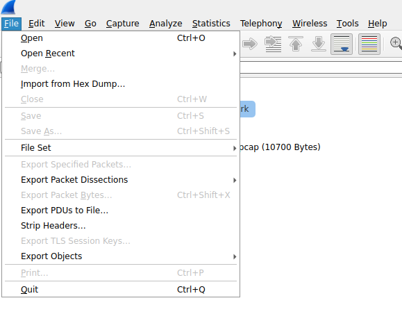

# **How To Packet Sniff on a Network**

## Scope
This guide will show you how to use a linux shell to capture and view packets on a network. These steps will take you from opening the shell to viewing packet information. However, the setup/installation of the linux shell and details of packet information are outside the scope of this guide.

## What is packet sniffing?
Packet sniffing refers to monitoring a network and capturing data packets that are sent over the network.

## Assumptions
- You have a working Linux shell 
- You have sudo access on your linux shell
- You have an internet connection

## 🛑**Warning**🛑
Make sure you are ethical when capturing network traffic. Listed below are basic rules to follow when packet sniffing:

- Only capture packets on networks that you own or have the owner's position to capture from
- Do not store any sensitive data from captured packets
- Only use packet sniffing for ethical purposes, which include, but are not limited to:
    - Network troubleshooting
    - Network security
    - Learning about networks

## 1. Install the tcpdump and wireshark packages
- Run the following two command lines:
    - sudo apt install tcpdump
    - sudo apt install wireshark
- tcpdump is a tool to capture packets
- wireshark is a tool to visualize packet information

## 2. Discover your network interfaces
- Run the following command:
    - ip link
- The terminal output should similar to the image below:

## 3. Choose the correct network interface name
- If you are running linux directly on your computer, choose "wlan0"
- If you are running linux on top of a different operating system, choose "eth0"
    

## 4. Capture packets
- Run the following command, where {interface} is either "wlan0" or "eth0" (refer to step 3)
    - sudo tcpdump -i {interface} -c 20 -w capture.pcap
        - tcpdump: "capture packets with this tool"
        - -i {interface}: "capture packets on this interface"
        - -c 20: "capture 20 packets and then stop"
        - -w capture.pcap: "write captured packets to a file named capture.pcap"

## 5. Ensure that the packet capture has stopped
- If successful, you should see output similar to the image below:

    

- If not, run the command from step 5 again

## 6. Open the wireshark graphical application
- Run the following command to open wireshark:
    - wireshark
- The following should appear on your screen:

## 7. Find your captured packet file
- Click "file" and then "open" in the top left corner of the wireshark window

## 8. Open the captured packet file
- Click "capture.pcap" in the file dialog box that opens

## 9. Choose an individual packet to view
- Click on a row of the table shown in the wireshark window (single row shown for privacy purposes)

## 10. View the individual packet details
- The packet details are now shown on the top part of the screen

